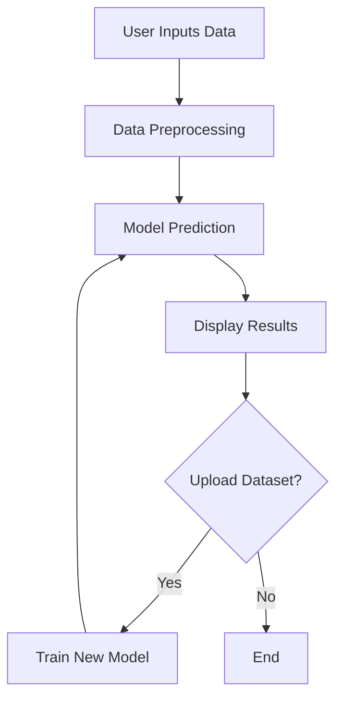

# Cancer Diagnosis Predictor - Streamlit

## Introduction

Streamlit Cancer Predict is a web-based application designed to predict the likelihood of cancer using machine learning models. The app leverages Streamlit for the user interface and scikit-learn for model training and inference. It aims to provide an accessible tool for medical professionals, researchers, and students to quickly assess cancer risks from clinical data.

## Usage

To use Streamlit Cancer Predict, users input relevant medical features into the web interface. The app processes this data, applies a trained machine learning model, and displays the prediction. Users can interactively modify inputs to observe different outcomes, helping them understand the influence of each feature on the prediction.

## Features

- Intuitive web interface powered by Streamlit
- Machine learning model for cancer prediction
- Real-time inference and display of results
- Option to upload and process datasets
- Visualization of feature importance and prediction probabilities
- Support for model retraining using user-supplied data

## Configuration

You can customize the application by editing configuration parameters in the Python source files or via the Streamlit interface. Typical configurable options include:

- Model selection (if multiple models are available)
- Feature set selection
- Data preprocessing options
- Prediction threshold (for binary classification)
- UI theme and layout

## Installation

Follow these steps to set up Streamlit Cancer Predict on your local machine:

1. Clone the repository:

    ```bash
    git clone https://github.com/Sathwik656/streamlit-cancer-predict.git
    cd streamlit-cancer-predict
    ```

2. Create and activate a virtual environment (optional but recommended):

    ```bash
    python -m venv venv
    source venv/bin/activate  # On Windows: venv\Scripts\activate
    ```

3. Install the required Python packages:

    ```bash
    pip install -r requirements.txt
    ```

4. Run the Streamlit application:

    ```bash
    streamlit run app.py
    ```

5. Open your browser and go to the provided local URL (typically `http://localhost:8501`).

## License

This project is licensed under the MIT License. You are free to use, modify, and distribute the code with proper attribution.

## Requirements

- Python 3.7 or higher
- Streamlit
- scikit-learn
- pandas
- numpy
- joblib
- Matplotlib (if data visualization is used)
- Any other dependencies listed in `requirements.txt`

## Architecture Overview

The application consists of three main components:

- **User Interface:** Built with Streamlit for interactive data entry and visualization.
- **Machine Learning Model:** Trained using scikit-learn; handles data preprocessing, prediction, and post-processing.
- **Data Management:** Supports CSV uploads and in-memory processing for predictions and retraining.

### Application Workflow



## Contact

For questions, suggestions, or contributions, please open an issue or submit a pull request on the project’s GitHub repository.
